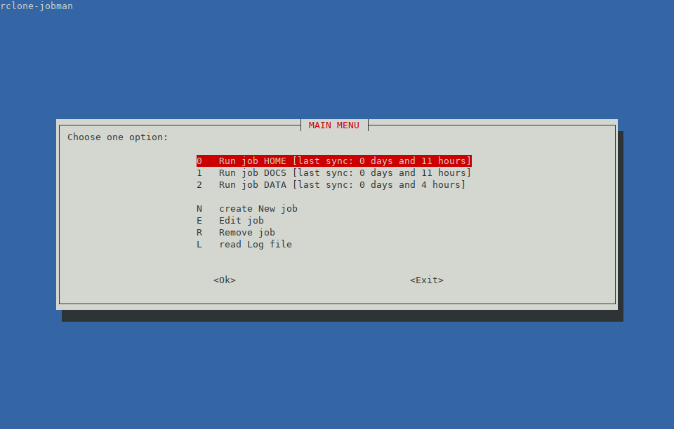

# rclone-tasks

[](https://github.com/carlescn/rclone-tasks/blob/main/LICENSE)
[](https://www.gnu.org/software/bash/)
[](https://www.linux.org/)
[](https://rclone.org/)
[](https://linux.die.net/man/1/whiptail)
[](https://mikefarah.gitbook.io/yq)

## About

**rclone-tasks** is a simple task manager
that aims to simplify dealing with multiple sync tasks
when using [Rclone](https://rclone.org/).



I first wrote it as a very simple script
for my specific needs,
but later I thought it would be a good exercise
to try and make it more convenient for general use.
So I expanded it adding a simple TUI
for running tasks, reading the logs,
and adding, editing and removing tasks.

For now, the Rclone options are "hard-coded"
(I mean, this is a simple script after all...)
for the way I use it.
I may change this in the future
and make the options task-specific,
saving them on the [task file](#task-files) instead.

## Install

I provide a script [install-rclone-tasks.sh](https://github.com/carlescn/rclone-tasks/blob/main/install-rclone-tasks.sh)
that copies all the files
(including the desktop entry and icon)
to the appropriate `$HOME/.local` directories,
and creates the necessary subdirectories under `$HOME/.config/rclone-tasks/`.

### Dependencies

The script is written and tested in Bash v5.1,
but should work at least on v4.0.
It depends in some external open-source software:

- [rclone](https://rclone.org/)
  for obvious reasons.
  I has installed v1.53.3 when writing the script.
  I haven't tested it on older versions.
- [whiptail](https://linux.die.net/man/1/whiptail)
  to draw the TUI.
  It should be available on most Linux distributions
  (on some it's part of a package called **newt**).
  I had installed v0.52.21 when writing the script.
  I haven't tested it on older versions.
- [yq](https://mikefarah.gitbook.io/yq)
  to read TOML files.
  It should be available on most Linux distributions.
  I had installed v4.43.1 when writing the script.
  I haven't tested it on older versions.

## Usage

If rclone-tasks is called without any argument
it will run in interactive mode with a TUI,
listing all the available tasks and options.
You can choose to run a task,
create, edit or remove one,
or read a log file.

Alternatively,
if a task configuration file is passed as an argument,
it will run this task without user interaction and exit.
This is intended to be used to automate backups,
for example using cron or anacron
(see [example files](https://github.com/carlescn/rclone-tasks/tree/main/example_files)).

### Files

The main script `rclone-tasks` is intended to be put (or linked)
in a directory contained in `$PATH`.
The other scripts must be in the same directory as the main one.

Each task is defined by a TOML file,
whose basename (without the extension) is used to uniquely identify it.
Other files related to this task must share the same basename.
These files must be put in subdirectories under `$HOME/.config/rclone-tasks/`:

- `tasks/basename.toml`: a TOML file that defines the task.
- `log/basename.log`: rclone will save here the logs of the last run.
  This file is erased at the start of every run.
- `lock/basename.lock`: is used with
  [flock](https://manpages.debian.org/testing/util-linux/flock.1.en.html)
  to prevent the task from starting
  if the last execution has not ended
  (which could happen when used with automation).

### task.toml example

See [example.toml](https://github.com/carlescn/rclone-tasks/blob/main/example_files/example.toml) for a commented example.

```toml
[task]
name = "This is an example"
dry_run = true

[paths]
source      = "/path/to/source"
destination = "rclone_remote_name:/path/to/destination/"

[filter]
rules = [
  "- secret*",
  "+ *.jpg",
  "+ file.txt",
  "- /dir/Trash/**",
  "+ /dir/**",
  # exclude everything else
  "- *",
]
```

### Desktop entry

I provide a desktop entry file
that calls main script on a terminal
to be used from a graphical desktop environment:
[rclone-tasks.desktop](https://github.com/carlescn/rclone-tasks/blob/main/rclone-tasks.desktop).
It should be placed under `$HOME/.local/share/applications/`.
For it to show the icon correctly,
the provided icon [rclone.png](https://github.com/carlescn/rclone-tasks/blob/main/rclone.png)
must be placed under `$HOME/.local/share/icons/`

> NOTE: this icon is taken from the
[rclone-webui-react repository](https://github.com/rclone/rclone-webui-react).
